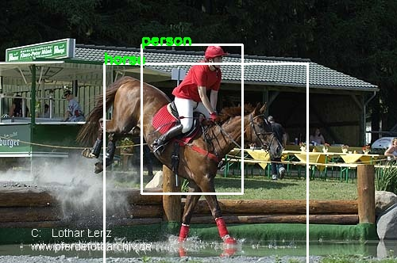

# Tensorflow2.0 SSD 
[Single Shot MultiBox Detector](https://arxiv.org/abs/1512.02325) implement in Tensorflow2.0 and OpenCV.

## Dependency
```
python >= 3.5.0
tensorflow == 2.2.0
opencv >= 3.3 

```

## Convert Pretrain VGG16 Model for SSD

```
python convert_vgg16.py
```

## Download VOC12 training data
From here [VOC12](http://host.robots.ox.ac.uk/pascal/VOC/voc2012/) download train data and unzip to data folder like:

```
$REPO_PATH/data

$ tree data/ -L 2
data/
└── VOC2012
    ├── Annotations
    ├── ImageSets
    ├── JPEGImages
    ├── SegmentationClass
    └── SegmentationObject

```

## Generate Voc list

```
python gen_voc_list.py
```

then get one voc_list.txt

## Train
recommand use pretrain model

```
python train.py
```

## Test
```
python test.py
```

# Result
  


